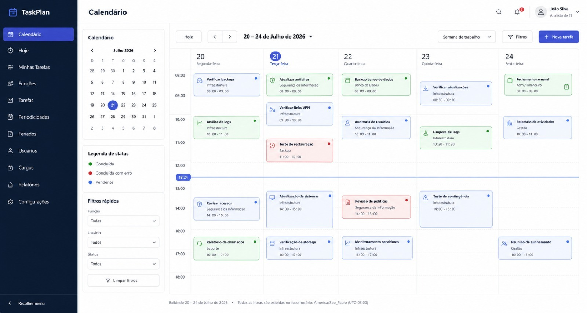

# UX/UI do TaskPlan

A imagem acima é a referência visual principal desta renovação. A imagem complementar do modal está em [assets/referencia-modal-calendario-taskplan.jpg](assets/referencia-modal-calendario-taskplan.jpg). Elas são referências de composição, não representam dados fictícios do produto.

## Direção visual

- Navegação: fundo azul-marinho `#0B1D35`, texto principal branco e texto secundário `#B8C4D8`. O item ativo usa azul `#3158C8`.
- Superfícies: branco sobre cinza muito claro `#F7F8FB`, bordas `#E5E8EF`, sombras discretas apenas em cartões e modais.
- Hierarquia: título da área no cabeçalho; contexto em *eyebrow*; ação primária azul alinhada à direita; ações secundárias contornadas.
- Status: azul para pendente/em andamento, verde para concluída, vermelho para falha/cancelada e âmbar para atenção. Cor nunca é a única indicação: cada estado também possui texto.
- Iconografia: `tp-icon` concentra os símbolos SVG nomeados e tipados. Cada ícone tem largura e altura explícitas de 20 × 20 px; menus e ações não usam caracteres Unicode como ícones.

## Navegação e responsividade

A navegação é dividida em Operação (Calendário, Hoje e Minhas tarefas), Administração (Tarefas, Funções, Periodicidades, Feriados, Usuários, Cargos e Perfis) e Futuro (Relatórios e Configurações). Itens administrativos só são exibidos e roteados para perfis `ADMIN`; as duas áreas futuras não simulam dados.

No desktop a sidebar pode ser recolhida: ficam somente os ícones e o atributo `title` fornece o tooltip nativo. Ela tem rolagem interna, para que nenhum item desapareça em zoom alto. Em até 820 px — inclusive em larguras equivalentes a 200% de zoom — vira um drawer acionado pelo cabeçalho. A sobreposição tem fundo de bloqueio e fecha ao clicar fora.

O calendário abre em mês e oferece semana útil e semana completa. Em telas estreitas a grade é substituída pela agenda do dia selecionado, evitando rolagem horizontal da página. A grade, mini calendário, filtros e legenda continuam disponíveis no desktop.

## Formulários e modais

Modais usam `role="dialog"` ou `role="alertdialog"`, suportam Escape, salvam o último elemento focado e devolvem foco ao fechar. No desktop são largos o bastante para formulários de duas colunas; em celulares ocupam toda a tela, com rodapé de ação visível. Campos obrigatórios e erros da API são anunciados na própria área do formulário.

A tabela administrativa é configurada por recurso, com colunas, filtros, campos e relações conhecidos em tempo de compilação. Ela oferece pesquisa, paginação, consulta, edição, confirmação, notificações e inativação/reativação. `DELETE` é sempre apresentado como **Inativar**: não há exclusão física.

## Operação

Cada cartão do calendário abre os detalhes da ocorrência. Quando `canOperate` for verdadeiro, o operador pode iniciar, concluir ou reagendar conforme o status. Um administrador também pode excluir uma ocorrência específica da agenda após confirmação: a tarefa cadastrada e as demais datas permanecem inalteradas. Duração é digitada como `hh:mm` e enviada à API em minutos; o resultado aceita sucesso, parcial ou erro, com observações. Ocorrências finais permanecem somente para consulta.

## Acessibilidade

O contraste mínimo dos textos e controles é AA. Todo controle interativo tem foco visível, rótulo acessível ou `aria-label`, e os ícones decorativos usam `aria-hidden`. A aplicação é planejada para 1440, 1024, 768 e 390 px, além de uma largura CSS equivalente a 200% de zoom.

## Responsabilidades

| Área | Responsável |
| --- | --- |
| Regras e negócio | Daniel Cruz |
| Backend | Matheus Santos |
| Frontend e deploy | Bernardo Marques |
